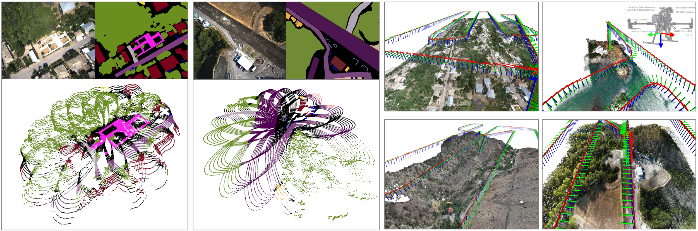
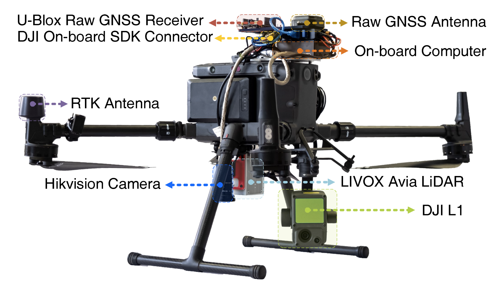

# UAVScenes 
UAVScenes: UAVScenes: A Multi-Modal Dataset for UAVs

[arXiv] [ICCV 2025]

We introduce UAVScenes, a large-scale dataset designed to benchmark various tasks across both 2D and 3D modalities. Our benchmark dataset is built upon the well-calibrated multi-modal UAV dataset MARS-LVIG, originally developed only for simultaneous localization and mapping (SLAM). We enhance this dataset by providing manually labeled semantic annotations for both images and LiDAR point clouds, along with accurate 6-degree-of-freedom (6-DoF) poses. These additions enable a wide range of UAV perception tasks, including detection, segmentation, depth estimation, 6-DoF localization, place recognition, and novel view synthesis (NVS). To the best of our knowledge, this is the first UAV benchmark dataset to offer both image and LiDAR point cloud semantic annotations (120k labeled pairs), with the potential to advance multi-modal UAV perception research. 

  

## Dataset Overview
- UAVScenes is built based on [MARS-LVIG](https://mars.hku.hk/dataset.html). Thanks for their excellent work.

- We use [X-AnyLabeling](https://github.com/CVHub520/X-AnyLabeling) for 2D annotating, [CloudCompare](https://www.danielgm.net/cc/) for 3D annotating, and [DJI Terra (大疆智图)](https://enterprise.dji.com/dji-terra) for 3D reconstruction.

- We include 
    - Hikvision camera images
    - Livox Avia LiDAR point clouds
    - 6-DoF poses 
    
- More sensor and scene information can be found from [MARS-LVIG](https://mars.hku.hk/dataset.html).

<!--  -->

  

## Download
UAVScenes has been uploaded onto various cloud platforms.
- [OneDrive](https://entuedu-my.sharepoint.com/:f:/g/personal/wang1679_e_ntu_edu_sg/EgY6DU5GBchIiAIa-eQZmEAB0vJx3khCPHbFW3LnR77RFw?e=26GaSc)
- [Google Drive](https://drive.google.com/drive/folders/1HSJWc5qmIKLdpaS8w8pqrWch4F9MHIeN?usp=sharing)
- [Baidu/百度网盘](https://pan.baidu.com/s/13CgnxRFqevQ8Fa1Y3dkM0A?pwd=1679)

## Baseline Code
Under preparing. Please stay tuned.

## Citation

## License
This work is available under a [Creative Commons Attribution-NonCommercial-ShareAlike 4.0 International License](https://creativecommons.org/licenses/by-nc-sa/4.0/) and is meant for academic use only. If you wish to use the dataset for commercial purposes, please get in touch with us.